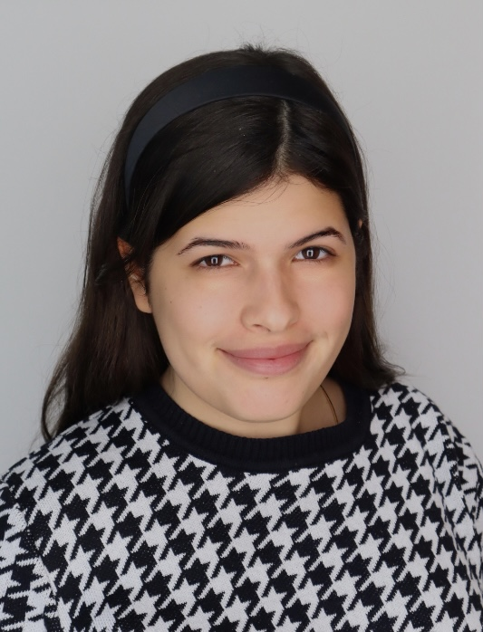

## Hi there 👋
# 👤 Lissa Telles Chaves 

📫 How to reach me: 
 - email: ltelles2@nd.edu
 - LinkedIn: www.linkedin.com/in/lissa-telles-chaves-48668a28a
⚡ Fun fact: I am originally from Brazil, and I have worked in Brazil, the US and Hong Kong. 

# 📖 Third-year Student at the University of Notre Dame
  -  Major: Marketing
  -  Minors: Computing and Digital Technologies, Collaborative Innovation!

## Tech toolbox 🦾
  - Languages: Python, MatLab, R
  - Libraries & frameworks: Numpy, Pandas, Matplotlib, Seaborn

## Goals 🥅
### January - May 2025
By the end of the first semester, I hope to make a **comprehensive final project**, building a multi-feature application that showcases data visualization, processing, and machine learning to solve a real-world challenge. To achieve this goal, I first must:
- **OOP:** Refine my knowedlege of object-oriented programming.
- **data visualization and storytelling:**  transitioning from static charts to interactive dashboards using Streamlit. I want to learn how to present data effectively through filtering, sorting, and narrative techniques.  

-  **data wrangling and preprocessing:** cleaning, transforming, and validating datasets, handling missing values, reshaping tables, and working with time-series data to prepare for analysis and modeling.  

- **data structures and databases:** working with stacks, queues, and hash tables while gaining hands-on experience with SQLite and ETL processes to integrate databases into applications.  

- **text and image processing:** using NLP tools like NLTK and SpaCy for sentiment analysis and text processing, along with OpenCV and Pillow for image-related tasks.  
- **foundational machine learning concepts:** training models using scikit-learn, and integrating them into interactive applications while considering ethical implications.  

## Recent Projects: 
 - Check out my python portfolio, where I accomplished my goals for the Spring 25: https://github.com/lissa-telles-chaves/TELLES-Python-Portfolio
